<h2 align="left">👋 Hi, My name is Jerald Anthoni Olin A. Pascual</h1>

<h4 align="left">I’m a first-year student focused on building with React, composing modular components, managing state, and crafting responsive UIs. For backend needs, I use Firebase (Auth, Firestore), handling data flow, real-time updates, and lightweight server logic so I can ship end-to-end features quickly.
</h4>

###

<h4 align="left">I’m also really into developer workflows and productivity tools especially GitHub Actions for automation, and Notion and Obsidian for organizing ideas, notes, and projects. I enjoy contributing to open source, learning through hands-on projects, and constantly improving how I build and ship things.</h4>

###

<h3 align="left">🛜 Connect with me</h3>

 
 

###

<h3 align="left">⌨️ Developing...</h3>

🔭 I’m currently working on: 1agenda. 🌱 I’m currently learning: ReactJS.

###

<h3 align="left">🚀 Technologies</h3>

###

  
  
  
  
  
  
  
  
  
  
  
  
  
  
  
  
  
  
  
  
  
  
  
  
  
  
  
  
  
  
  
  
  
  
  
  
  
  
  
  
  
  
  

###

<h3 align="left">💫 Github Stats</h3>

###

